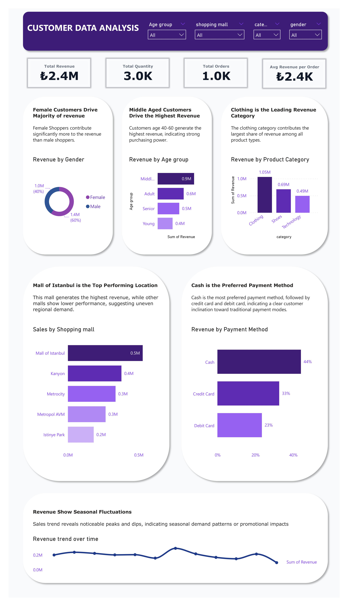

# 🏬 Customer Data Analysis Dashboard

## 📌Overview

This project analyzes customer purchasing behavior and revenue trends using an interactive Power BI dashboard.

It transforms raw transactional data into actionable business insights across customer segents, product performance and sales trends.


---


## 🛠️ Tools Used
•	Power BI – Data visualization & dashboarding

•	SQL – Data analysis & transformation

•	Excel – Data cleaning & preparation


---


## 📊 Key Insights
•	Female customers contribute the highest share of revenue

•	Middle-aged customers are the most valuable segment

•	Clothing is the top-performing category
	
•	Cash is the most preferred payment method
	
•	Mall of Istanbul generates the highest revenue
	
•	Revenue shows clear seasonal fluctuations


---


## 🖼️ Dashboard Preview



---

## 📊 SQL Analysis

This section demonstrates how SQL was used to extract insights that power the dashboard and business decisions.

---
### 🔹 KPI Calculations

```sql
SELECT
    SUM(quantity * price) AS total_revenue,
    COUNT(DISTINCT invoice_no) AS total_orders,
    SUM(quantity * price) / COUNT(DISTINCT invoice_no) AS avg_revenue_per_order
FROM cx_dataset;
```
**💡Insights:**
	•	Reveals overall performance and highlights opportunities to increase average order value.

---

### 🟢 Revenue by Segment (Gender and Age)

```sql
SELECT
gender,
SUM(quantity * price) AS revenue
FROM cx_dataset
GROUP BY gender
ORDER BY revenue DESC;
```
```sql
SELECT
CASE
WHEN age BETWEEN 18 AND 25 THEN 'Young'
WHEN age BETWEEN 26 AND 39 THEN 'Adult'
WHEN age BETWEEN 40 AND 60 THEN 'Middle Aged'
ELSE 'Senior'
END AS age_group,
SUM(quantity * price) AS revenue
FROM cx_dataset
GROUP BY age_group
ORDER BY revenue DESC;
```

**💡Insights:**
•	Identifies high value customer groupss, enabling targeted marketing and personalization.

---

### 🟢 Revenue by Product Category

```sql
SELECT
category,
SUM(quantity * price) AS revenue
FROM cx_dataset
GROUP BY category
ORDER BY revenue DESC;
```


**💡Insights:**
•	Highlights top performing products, supporting inventory and growth strategy decisions.

---

### 🟢 Daily Revenue Trend

```sql
SELECT
DATE(STR_TO_DATE(invoice_date, '%d-%m-%Y')) AS sales_date,
SUM(quantity * price) AS daily_revenue
FROM cx_dataset
GROUP BY sales_date
ORDER BY sales_date;
```


**💡Insights:**
•	Reveals demand and seasonality patterns to enables better forecasting and Improved staffing & inventory planning.

---


## 📂 Project Structure
```bash
customer-data-analysis-dashboard/
├── customer-dashboard.pbix
├── README.md
├── data/
├── images/
    └── dashboard.png
```

---


## ▶️ How to Use
1.	Download the .pbix file

2.	Open it using Power BI Desktop
   
3.	Interact with filters to explore insights


---


## 💡 Business Recommendations
•	Focus on high-value customer segments to increase revenue

•	Optimize and expand top-performing product categories
	
•	Encourage adoption of digital payment methods
	
•	Improve performance in underperforming locations

---


## 🚀 Outcome

This project demonstrates the ability to combine technical SQL skills with business thinking, delivering insights that support data-driven decision-making.

---

## 👤 Author
Agberhiere Kesiena Perez 

Aspiring Data Analyst 
